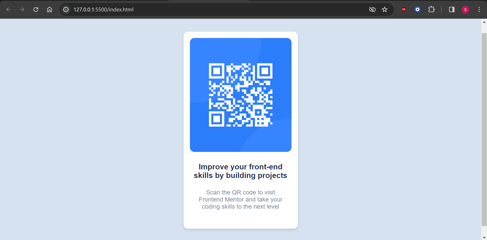

# Frontend Mentor - QR code component solution

This is a solution to the [QR code component challenge on Frontend Mentor](https://www.frontendmentor.io/challenges/qr-code-component-iux_sIO_H). Frontend Mentor challenges help you improve your coding skills by building realistic projects. 

### Screenshot

### Links

- Solution URL: (https://your-solution-url.com)
- Live Site URL: (https://github.com/saloni0419/QR-code-component)

## Author

- Frontend Mentor - (https://www.frontendmentor.io/profile/saloni0419)
- Twitter - (https://twitter.com/ssalonirajput)

